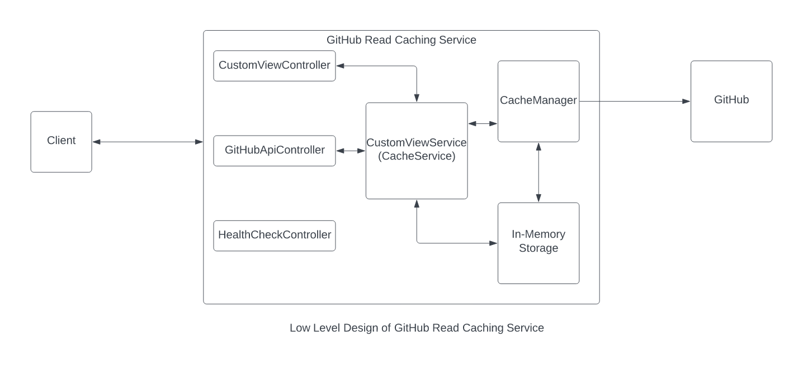

# Github Read Caching Service for Netflix

* This service periodically (default 1 Hr) caches data from below apis in memory
  * / 
  * /orgs/Netflix 
  * /orgs/Netflix/members 
  * /orgs/Netflix/repos
* This service also caches below-mentioned views based on the data obtained from the above api-responses
  * /view/bottom/N/forks : Bottom-N repos by number of forks 
  * /view/bottom/N/last_updated : Bottom-N repos by last updated time 
  * /view/bottom/N/open_issues : Bottom-N repos by open issues 
  * /view/bottom/N/stars : Bottom-N repos by stars
* The service is also able to proxy other github api urls which are not supported by this service to github and return the response

## API's Supported
* /
* /orgs/Netflix
* /orgs/Netflix/members
* /orgs/Netflix/repos
* /view/bottom/N/forks
* /view/bottom/N/last_updated 
* /view/bottom/N/open_issues
* /view/bottom/N/stars
* /** (Any other route proxied to github)

## How to run the service
* Clone the repository
* Build the package and run the GitHubApiCacheApplication by providing a port number
  * You can run this service from an IDE by configuring the rune command or from terminal by passing the port number
* (Optional) Uncomment the cache.refreshDelay in application.properties. By default set to an hour. This property determines after how much interval to refresh the cache
* (Optional) Uncomment the GITHUB_API_TOKEN in application.properties. If this value is set then it will be passed to github api to overcome the rate-limit. If not then it will still work but request might get throttled.

## Assumptions
* This service requires Java 17 
* Cache by default will be refreshed every 1 hour
* We will be using In-memory cache for this assignment
* We are assuming there is not a huge amount of data so no constraints on the memory side
* The current system is designed such that most of the computation is done during caching like sorting to make the application read heavy (more read effective)
* For the purpose of this assignment, no need to add unit tests, integration tests, logging, exception handling.
* This service doesnt uses the potential of concurrent processing and isnt optimized on parallel processing
* The service doesnt handle any security aspects in terms of authentication and authorization
* This service doesnt properly handle exceptions.
* Service doent have logging and monitoring

## Low Level Diagram

## Future improvements
* Proper variable and service naming
* Proper dependency injection
* Have a DB supported persistent cache rather than in-memory
* Add support for threading and concurrency at multiple levels right from cache loading to handling requests
* Optimize caching mechanism
* Add unit tests, integration tests
* Add proper exception handling
* Add logging and monitoring
* Improve on service code structure

## Integration Test results based on api-suite.sh
* I was able to pass 13 out 30 tests.
* The reason for failure for other tests is because the data has gotten stale
  * For e.g for last updated date related testcases are for 2021 but I was able to validate through github api's that the oldest date for last update was on 2022

